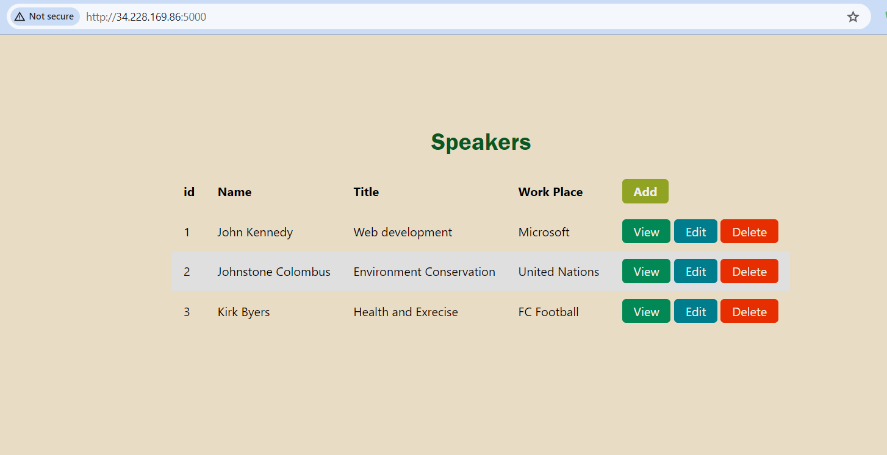

# Deploy-an-AWS-ECS-Cluster-on-EC2-with-Terraform-
This repo has been created to deploy an aws ecs cluster on EC2 instances with terraform step by step.

## Getting Started
The first step is to clone this repo by running command:
`git clone https://github.com/engrbilal1/Deploy-an-AWS-ECS-Cluster-on-EC2-with-Terraform-.git`

## If you want to Check the Project work then do the Below 2 Steps
##### Install dependencies

`sudo apt update`
`sudo apt install npm -y`
`npm install`
`npm audit fix`
`npm fund`
##### Run Snap Shot from the root directory

`node index.js`

## For the ECS you should do the following steps

##### Build the image

`docker build -t node_pro:latest .`

##### Go to the ECR Repository and just check Push command provided by AWS ECR

Now for this project  we will create a private registry on AWS, then push image to `ECR_Repo` repository.
Then we will provision infrastructure on AWS using Terraform which is also available in the same repository.
